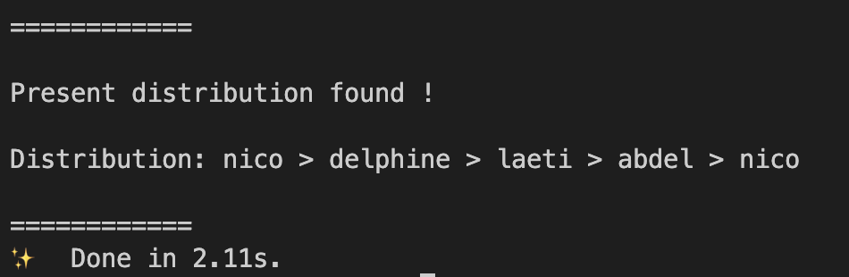
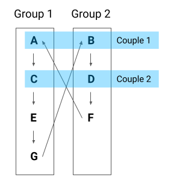

# Secret Santa Algorithm - Typescript - TDD

## 💡 Problem description

This repository contains an implementation of the secret santa algorithm with the following rules:

- **Rule 1 - Unicity rule**: each participant must offer and receive only one gift
- **Rule 2 - Reciprocity rule**: if A offers a gift to B, B cannot offer a gift to A
- **Rule 3 - Couples rule**: participants that are part of a couple cannot offer / receive a gift from their partner

## 🚀 Solution implemented

### Algorithm description

- The algorithm takes two parameters (under the form of JSON strings - ⚠️ values inside the arrays must be double quoted):

  - people: list of the participants (ex: `["adèle", "benjamin", "christian", "diane", "erwan"]`)
  - couples: array of the couples among participants (ex: `[["adèle", "erwan"], ["diane", "christian"]]`)

  and prints a possible distribution satisfying the constraints (when it can be found)

  

- To compute the distribution, the algorithm first handles two special cases for small number of participants:

  1. if there are only 2 people (or less), it is impossible to satisfy the reciprocity rule: A offers to B and B must offer to A (breaking the rule)
  2. if there are 3 people with 1 couple, it is impossible to satisfy the couples rule AND the reciprocity rule: if A and B are in a couple, only one of them can offer a present to C, and the other one has no choice but offering to his / her partner

- Once those two special cases handled, the algorithm treats other cases with the following heuristics:

  - split all couple members in 2 different groups
  - split the single participants and add them at the end of each group
  - let each member of group 1 offer a present to the next one in group 1 (no issue with the couple rule because all their partners are in group 2)
  - the last member of group 1 will offer to the first member of group 2 (i.e. to the second member of the 1st couple)
    - 💡 We know that this relation will not break the couples rule because we are in either one of those two cases:
    1. there is only 1 couple - in this case, we know we have at least 4 people (cf special cases handled previously) so the last member of group 1 has to be a single person, so he can offer a present to the first member of group 2 ;
    2. there are 2 couples or more - in this case, the last person of group 1 will be either a single person or belong to the last couple, so he/she can offer a present to the first member of group 2 (who belongs to the first couple)
  - then let each member of group 2 offer a present to the next one in group 2
  - the last member of group 2 will offer to the first member of group 1 - the same reasoning applies here in reverse side

- The splitting in 2 groups is summarized here by the following diagram:



### Limits

- **Homonyms bug**: the algorithm relies on strings that are directly the names of the participants - it will probably crash if two participants have the exact same name (which is not so unprobable)

  > **To go further**: we should implement ids for each participant rather than using directly their names

- **Deterministic distribution**: so far, this algorithm is deterministic: given the same input twice, it will return the same distribution twice - not very interesting if you want to reuse it two years in a row for your actual secret santa...

  > **To go further**: we could easily add a step to shuffle the inputs before applying the algorithm to find the distribution

- **More generic solution with custom constraints**: here we took some hypothesis on the problem that make it easier to solve. In particular, forbidden gifts only occur between couples, and we assumed that one person is only part of one couple. But what if we want to define a set of custom constraints? (which can be a use case for a real secret santa app, for example saying "I don't want to offer a present to my dad because I already offered him one last year"). The current algorithm would not be ok for such a use case

  > **To go further**: the generic solution to this problem is framed in terms of graph theory and hamiltonian cycles, as explained in [this article](https://binary-machinery.github.io/2021/02/03/secret-santa-graph.html). A solution could be to implement another type of algorithm, as described at the end of the article, by building step by step the final distribution. I did not choose to implement this kind of algorithm here because I wanted to timebox the exercise and focus on getting a working implementation as fast as possible, but this would probably be the best option in a real-world use case.

## 🤖 Code organization

### Dependencies

- First make sure you have [yarn](https://yarnpkg.com/) installed locally

- Then, to install the project dependencies, simply run `yarn install` from the top level folder of this repository

### Scripts

- After this, to launch the algorithm, run the following command from the terminal

```bash
yarn run computeDistribution --people='["a", "b", "c", "d", "e"]' --couples='[["a", "b"], ["c", "d"]]'
```

- This algorithm was written using TDD ([Test Driven Development](https://en.wikipedia.org/wiki/Test-driven_development)): to launch the test suite, simply run `yarn test`
